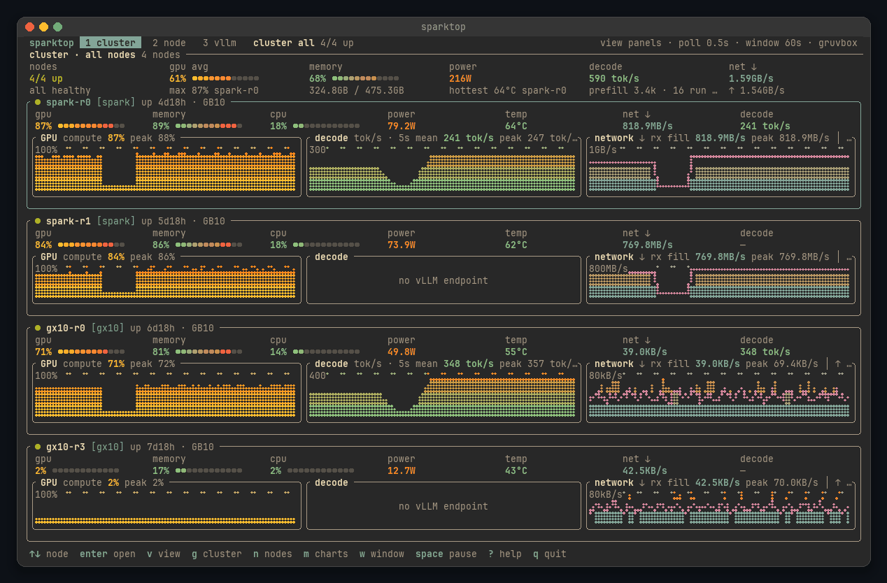
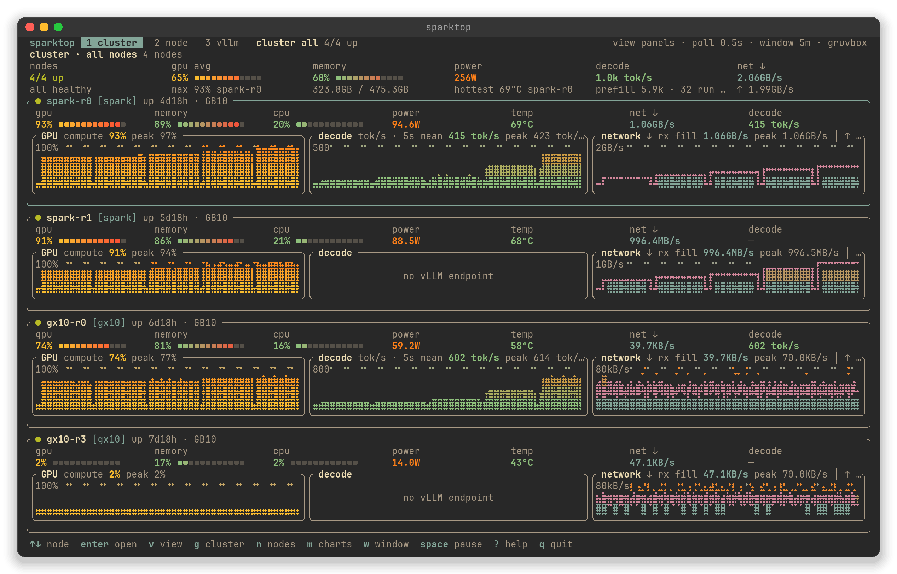
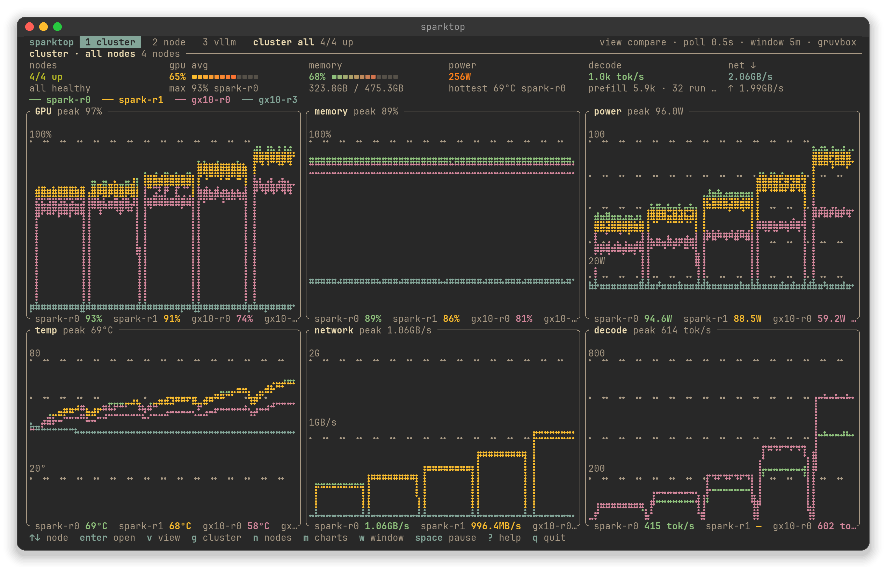
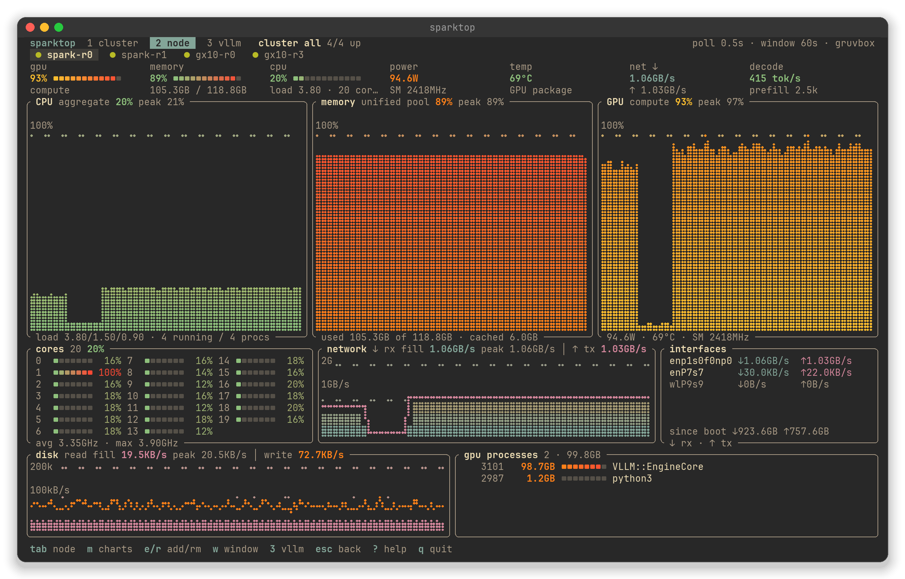
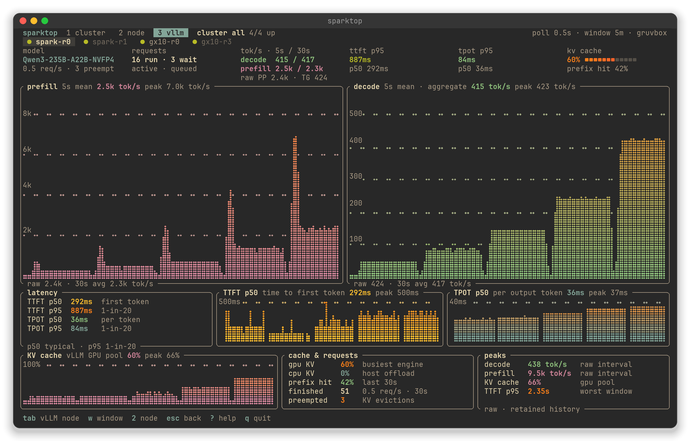
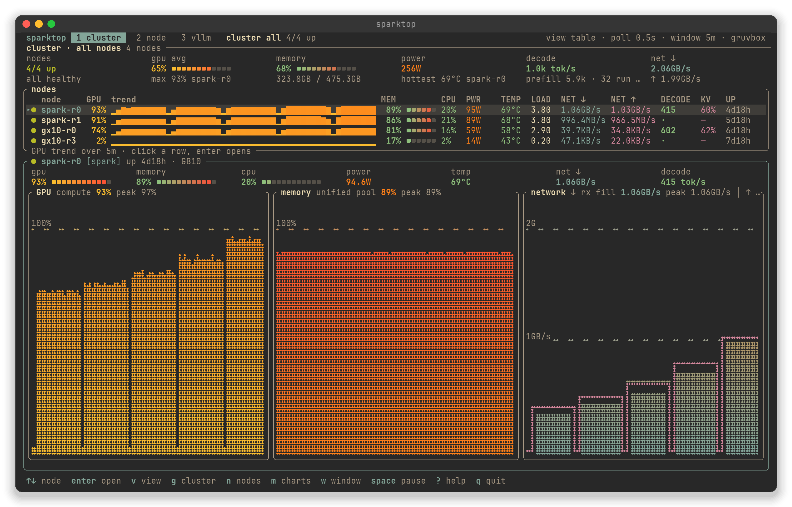
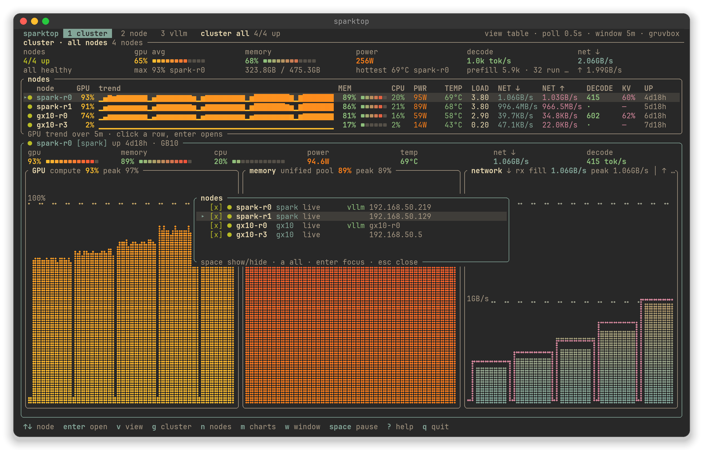
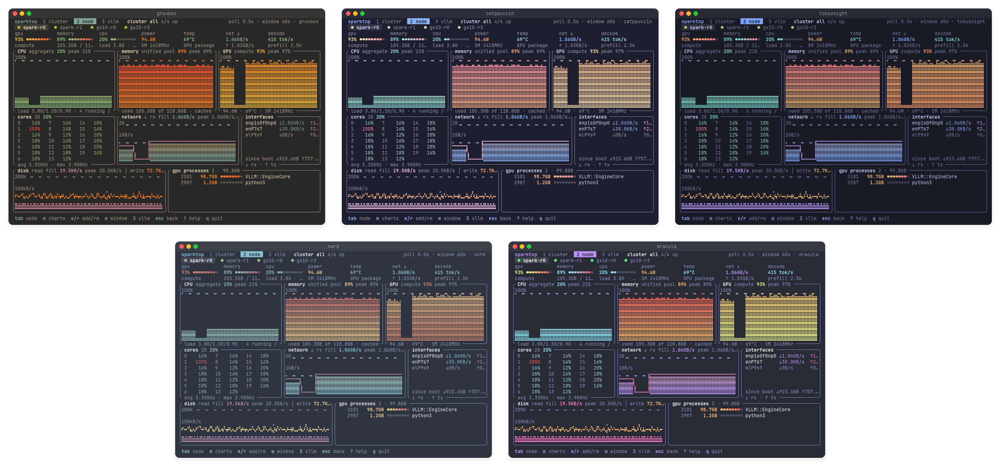

<div align="center">

# sparktop

**A terminal monitor for NVIDIA DGX Spark clusters.**
GPU, unified memory, CPU, network, disk, and live vLLM inference metrics
for every node, from one terminal, with nothing installed on the nodes.

[](https://github.com/nero-/sparktop/actions/workflows/ci.yml)
[](LICENSE)




</div>

---

## Why sparktop

`btop` and `nvtop` see one machine. `vllm-top` sees one server. A Spark
cluster is several boxes with a shared job, so sparktop shows them together
and tracks each one over time. You can watch a benchmark climb through
concurrency levels, see the tensor-parallel link light up, and notice when
one node falls behind.

- **Built for the whole cluster.** A summary strip with totals, then panels,
  a table with sparklines, or overlaid comparison charts. Group nodes into
  clusters and switch between them with one key.
- **Agentless.** One compound shell script per poll over a multiplexed SSH
  connection. No daemon, exporter, or Python on the nodes.
- **Fine-grained.** Polls as fast as every 0.5s, keeps 15 minutes of
  history, and computes rates from real elapsed time, so a slow poll never
  shows up as a fake spike.
- **Knows vLLM.** Prefill and decode tok/s (5s, 30s, and raw), TTFT/TPOT
  p50 and p95, KV cache, prefix-cache hit rate, queue depth, and preemptions.
- **Honest about health.** Every node tracks its own state: `● live`,
  `◐ stale`, `✕ down`, `○ connecting`. Frozen data never looks live.

## Screenshots

<table>
<tr>
<td width="50%"><br><sub><b>Cluster · panels</b>: a band per node with meters and your choice of charts</sub></td>
<td width="50%"><br><sub><b>Cluster · compare</b>: one chart per metric, one line per node</sub></td>
</tr>
<tr>
<td><br><sub><b>Node</b>: btop-style detail with a per-core grid, interfaces, disk, and GPU processes</sub></td>
<td><br><sub><b>vLLM</b>: throughput, latency percentiles, KV and prefix cache</sub></td>
</tr>
<tr>
<td><br><sub><b>Cluster · table</b>: scales to many nodes; spare space shows the focused node</sub></td>
<td><br><sub><b>Node picker</b>: show, hide, or jump to any node</sub></td>
</tr>
</table>

<details>
<summary><b>Themes</b>: gruvbox · catppuccin · tokyonight · nord · dracula</summary>
<br>

</details>

<sub>Screenshots come from a simulated vLLM concurrency sweep (1→16) rendered by the real UI code. See <a href="#regenerating-screenshots">Regenerating screenshots</a>.</sub>

## Install

```sh
# from source (Rust 1.85+)
git clone https://github.com/nero-/sparktop && cd sparktop
cargo install --path .

# or straight from GitHub
cargo install --git https://github.com/nero-/sparktop
```

**On your machine:** OpenSSH client. **On each node:** SSH key login
(`ssh-copy-id user@node`), `nvidia-smi`, and `curl` if you scrape vLLM.
Standard DGX OS already has all of this.

## Quick start

```sh
cp sparktop.toml ~/.config/sparktop/sparktop.toml   # or keep it next to you
$EDITOR ~/.config/sparktop/sparktop.toml            # list your nodes
sparktop
```

```sh
sparktop --config path/to/sparktop.toml
sparktop --interval 0.5      # poll every 0.5–10s (change live with + / -)
sparktop --cluster spark     # start filtered to one group
sparktop --once              # one text snapshot of every node, then exit
sparktop --once --json       # the same as JSON, for scripts and cron
sparktop --fresh             # ignore remembered UI preferences
sparktop --no-mouse          # keep your terminal's text selection
```

## Configuration

sparktop looks for `./sparktop.toml`, then `~/.config/sparktop/sparktop.toml`.

```toml
interval = 1.0            # seconds, 0.5–10
# theme = "nord"          # gruvbox | catppuccin | tokyonight | nord | dracula

[[nodes]]
name = "spark-r0"
host = "192.168.50.219"
user = "nero"
cluster = "spark"         # optional group; `g` filters by it
vllm_url = "http://localhost:8000"   # optional; fetched *from the node*

[[nodes]]
name = "spark-r1"
host = "192.168.50.129"
user = "nero"
cluster = "spark"

# [alerts]                # thresholds that turn values and borders warn/bad
# temp_warn_c = 75
# temp_crit_c = 85
# mem_warn = 0.90         # unified-memory fraction
# mem_crit = 0.97
```

- **Edits apply live.** sparktop watches the file and adds, removes, or
  re-points nodes without a restart. If an edit is broken, you get a message
  and the previous config stays in effect.
- **`vllm_url` is fetched from the node itself**, so `localhost` works even
  when the port isn't exposed to your network.
- **UI choices are remembered** in `~/.config/sparktop/state.json`: theme,
  view, charts, cluster filter, hidden nodes, and window.

## Keys

| key | action |
| --- | --- |
| `1` `2` `3` | cluster / node / vLLM pages (or click the header tabs) |
| `↑↓` `jk` `tab` | next / previous node (the vLLM page skips nodes without an endpoint) |
| `enter` · `esc` | open the focused node · go back (quits from page 1) |
| `v` | cluster view: **panels → table → compare** |
| `g` | cycle the cluster filter (all → each `cluster` group) |
| `n` | node picker: `space` show/hide, `a` show all, `enter` jump |
| `m` | chart picker for this page · `e` / `r` / `c` add / remove / reset |
| `w` `W` | graph window: 60s · 5m · 15m |
| `+` `-` | poll faster / slower |
| `space` | pause polling (graphs freeze and nothing is flagged stale) |
| `t` `T` | next / previous theme · `G` toggles the gradient fill |
| mouse | click a node to focus it, click again to open it, scroll to cycle |
| `?` | help · `q` / `ctrl-c` quit |

## What it shows

**Cluster page:** a summary for the selected group (nodes up, average and
max GPU, pooled memory, total power and the hottest node, total decode
tok/s, network), then one of three views:

- **panels:** a band per node with hero meters and up to six charts (two
  columns on wide terminals; switches to table when the bands would be too
  small)
- **table:** a row per node with a GPU sparkline, meters, and rates, which
  scales to many nodes. Leftover height shows the focused node's charts.
- **compare:** GPU, memory, power, temp, network, and decode, each with one
  colored line per node

**Node page:** hero meters and a chart row (CPU, memory, and GPU by default;
any of GPU, memory, CPU, load, power, temp, decode, or KV). Also a btop-style
per-core grid with clocks, network (rx fill with a tx line), the busiest
interfaces with live rates, disk (read fill with a write line), and GPU
processes sorted by memory.

**vLLM page:** model, running and queued requests, prefill and decode
graphs, TTFT/TPOT p50 and p95, KV-cache graph, prefix-cache hit rate,
finished req/s, preemptions, and peaks.

## How it works

Each node gets a poll thread that runs one compound script over SSH:
`/proc/stat`, `/proc/meminfo`, `/proc/net/dev`, `/proc/diskstats`,
`nvidia-smi`, and optionally `curl $vllm_url/metrics`. The connection is
reused through `ControlMaster`, so a poll is a few milliseconds of shell
rather than a new handshake. Everything else (rates, windows, percentiles)
is computed locally.

### Rate display

The vLLM page shows a time-weighted **5-second mean** for smooth live graphs,
a **30-second rolling average**, and the unsmoothed **raw** rate from the latest
counter interval. Rates divide token and byte counter changes by the actual
elapsed time on a monotonic clock, including delayed SSH polls. Idle intervals
count toward averages, and at startup averages use whatever history exists.
Missing metrics show as unavailable. A counter reset or a change in engine
series starts a new averaging segment.

Decode is the aggregate output across requests at the selected API endpoint.
Engine series are summed, and tensor-parallel GPU ranks are not counted twice.
This is not the same window as a benchmark's per-request generation average.
Prompt throughput includes idle time, so it is not a direct cold-prefill
benchmark. Peaks refer to raw samples still in history, not the process
lifetime. Latency percentiles are interpolated from changes in the cumulative
histograms between scrapes. KV occupancy is the busiest engine's value.
Finished req/s and prefix-cache hit rate are measured over 30 seconds.

## Troubleshooting

| symptom | fix |
| --- | --- |
| `✕ down: Permission denied (publickey)` | run `ssh-copy-id user@host`; sparktop uses `BatchMode` and never prompts |
| `✕ down: … timed out` | check that `ssh user@host true` works from this machine |
| vLLM page: "/metrics returned nothing" | run `curl <vllm_url>/metrics` **on the node**; the URL must work from there |
| GPU shows `—` | `nvidia-smi` is missing or failing on that node |
| mouse selection doesn't work | run with `--no-mouse`, or hold ⌥/Shift while selecting |

## Development

```sh
cargo test                         # parsers, rate math, and UI render tests
SPARKTOP_DUMP=1 cargo test --test render -- --nocapture   # print rendered screens
```

`scripts/fakessh.sh`, copied onto your `PATH` as `ssh`, serves canned node
output so you can drive the real TUI without hardware.

### Regenerating screenshots

```sh
cargo run --release --example screenshots          # simulated sweep -> target/screenshots
python3 scripts/screenshots.py target/screenshots docs/img   # PNGs + demo.gif (needs Pillow)
```

The example renders the real UI into a test backend. The script draws the
braille and box glyphs as geometry, so the images don't depend on your fonts.

## Acknowledgments

Graph renderer, theme system, and panel conventions adapted from
[vllm-top](https://github.com/mratsim/vllm-top) (GPLv3, © mratsim); layout
inspiration from [btop](https://github.com/aristocratos/btop). sparktop is
licensed under the [GPLv3](LICENSE) as a result.
